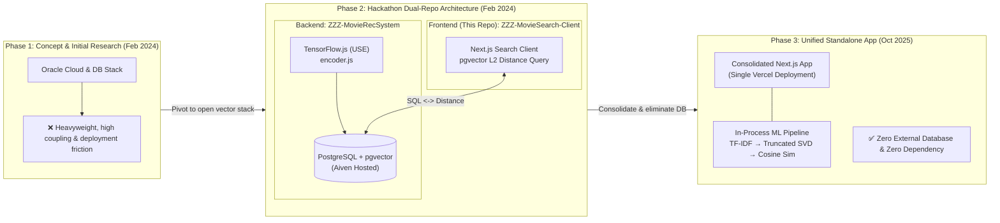

# ZZZ - Movie Recommender App


> [!NOTE]
> **Status (2026-08): Phase 2 Frontend Client.** This repository is the frontend search interface for the Phase 2 dual-repo architecture. The backend data ingestion and pgvector database setup lives in [`ZZZ-MovieRecSystem`](https://github.com/ZZZ-RecSys/ZZZ-MovieRecSystem), which in Phase 3 was rewritten into a consolidated, zero-database Next.js app.

## Project Evolution & Repository Map (3 Phases)



| Phase | Architecture & Repos | Details & Outcome | Team |
|---|---|---|---|
| **Phase 1: Research** (Feb 2024) | Oracle Cloud Ecosystem | Explored Oracle full-stack DB architecture; dropped due to tight coupling and deployment complexity | Yiwei Zhang (Lead), [Weiran Zhao](https://github.com/weiranzhao97) (Research) |
| **Phase 2: Dual-Repo MVP** (Feb 2024) | **Dual-Repo Pipeline**:<br/>• **Backend Ingestion**: [`ZZZ-MovieRecSystem`](https://github.com/ZZZ-RecSys/ZZZ-MovieRecSystem) (dataset ingestion, TF.js USE embedding, Postgres pgvector)<br/>• **Frontend Client (This Repo)**: [`ZZZ-MovieSearch-Client`](https://github.com/ZZZ-RecSys/ZZZ-MovieSearch-Client) (Next.js UI, real-time pgvector `<->` vector search) | Full vector search pipeline built for Global Hack Week: AI/ML; write-up on [DevPost](https://devpost.com/software/zzz-movie-recommender) | Yiwei Zhang (Engineering), [Weiran Zhao](https://github.com/weiranzhao97) (Docs & Research), [Shizhe Zhang](https://github.com/zhang-shizhe) (Ideation) |
| **Phase 3: Unified Standalone** (Oct 2025) | Unified Next.js on Vercel ([`ZZZ-MovieRecSystem`](https://github.com/ZZZ-RecSys/ZZZ-MovieRecSystem) current `main`) | Consolidated frontend and backend into a single zero-database app; runs TF-IDF + Truncated SVD in-process on Vercel | Yiwei Zhang (Solo refactor & delivery) |

## Technology Framework

This project is developed with [Next.js](https://nextjs.org/), initiated using [`create-next-app`](https://github.com/vercel/next.js/tree/canary/packages/create-next-app). It builds upon the [ZZZ-Movie RecSystem Data Pre-processing](https://github.com/ZZZ-RecSys/ZZZ-MovieRecSystem) repository, which imports a comprehensive movie dataset from Kaggle into a PostgreSQL database and enriches it with vector embeddings for each movie title.

To enhance the search functionality, our Movie Recommender App employs TensorFlow's [Universal Sentence Encoder](https://www.tensorflow.org/hub/tutorials/semantic_similarity_with_tf_hub_universal_encoder) for advanced semantic vector retrieval. Then we present search results through a responsive interface built with `React` and `Next.js`.

Guided by insights from Aiven's [guide on building a movie recommender](https://aiven.io/developer/building-a-movie-recommender), we've made enhancements to both the user interface and API. These updates serve as a foundation for a feature currently in development, which will offer personalized recommendations by analyzing users' search histories.

## Getting Started

This guide walks you through setting up a Node.js application that connects to a PostgreSQL database using environment variables for configuration.

## Prerequisites

- Node.js and npm installed on your machine. You can download them from [Node.js official website](https://nodejs.org/).

## Setup Instructions

### Step 1: Install Node.js

Ensure Node.js (which includes npm) is installed on your system. You can verify by running `node -v` and `npm -v` in your terminal.

### Step 2: Initialize Project

Navigate to your project's root directory in the terminal and install dependencies:

```bash
cd /path/to/your/project
npm install
```

### Step 3: Configure Environment Variables
Create a `.env` file in the project root with the following content:

```bash
PG_NAME=<your_database_name>
PG_PASSWORD=<your_database_password>
PG_HOST=<your_database_host>
PG_PORT=<your_database_port>
```

### Step 4: Download SSL Certificate
- Download the certificate `ca.pem` from [https://console.aiven.io/] and place it in your project.

### Step 5: Populate the PostgreSQL Database

Before running the development server, ensure your PostgreSQL database is populated with the initial dataset, located in [ZZZ-MovieRecSystem](https://github.com/ZZZ-RecSys/ZZZ-MovieRecSystem)

### Step 6: Run the Development Server
Start the development server with:

```bash
npm run dev
```

### Step 7: Access the Application
With the development server running, access your application through the browser at [http://localhost:3000](http://localhost:3000)

## Upcoming Enhancements

1. Implementing personalized recommendation features utilizing users' search histories for a more tailored experience.
2. Deploying the web application to a public domain for broader accessibility.

## Additional Information and Resources

- **Certificates**: Ensure your database client uses SSL/TLS with `ca.pem`.

- **DevPost**: For a detailed narrative on the project's evolution and insights, visit the [DevPost project page](https://devpost.com/software/zzz-movie-recommender?ref_content=user-portfolio&ref_feature=in_progress).

- **Dataset**: The source of the dataset is available on [Kaggle](https://www.kaggle.com/datasets/jrobischon/wikipedia-movie-plots), providing a rich repository of movie plots.
 Visit the [ZZZ-MovieRecSystem](https://github.com/ZZZ-RecSys/ZZZ-MovieRecSystem) to populate your database.


## Contributors
- Yiwei Zhang (Engineering)
- Weiran Zhao (Research & Documentation)
- Shizhe Zhang (Ideation)


